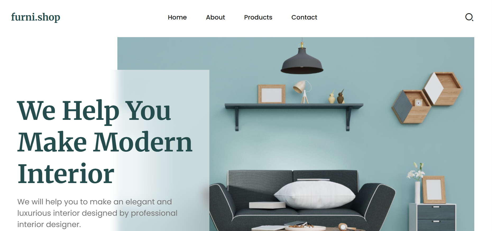

# furni.shop

A modern and responsive furniture e-commerce website template that provides users with a seamless experience to explore products, learn about deals, and connect with the team. Built with HTML, CSS, and JavaScript.

## Features

- Fully responsive design for all devices  
- Navigation menu with smooth scrolling  
- Showcase of products and new arrivals  
- Client testimonial slider using Swiper.js  
- ScrollReveal animations for smooth entrance effects  
- Newsletter subscription form  
- Footer with contact info and social links  

## Demo

[Live Demo](#)  

## Technologies Used

- HTML5  
- CSS3  
- JavaScript (ES6)  
- Swiper.js for testimonial slider  
- ScrollReveal.js for animations  
- Remix Icon for icons  

## Products & Services

- New Arrivals: Stylish chairs, lamps, tables, and home accessories  
- Hot Deals: Cashback, 30-day payment terms, and special discounts  
- About Us: Learn about our passion for modern and elegant interior design  
- Client Testimonials: See what our happy customers say about our products  

## Installation

1. Clone the repository:

 git clone https://github.com/fsafiya187/furni-shop.git

2.Navigate to the project directory:

cd furni-shop

3.Open index.html in your browser.

---

Usage

Browse products and explore new arrivals

Check out hot deals and promotions

Read client testimonials for credibility

Subscribe to the newsletter for updates

Use contact info in the footer to reach out

---

License

This project is licensed under the MIT License.

---

Contact

Email: fsafiya187@gmail.com

GitHub: fsafiya187
